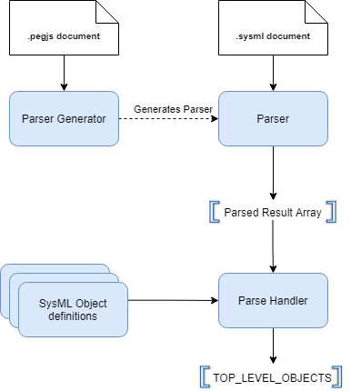

# D0020E
Project in Computer Science - SysML 2.0 Viewer in a Browser

## About the SysML 2.0 Viewer in a Browser (aka SysML v2 Web Viewer)
The SysML v2 Web Viewer is an application that is used to display SysML v2 diagrams that can be interacted with via a web browser. The idea is that a .sysml file is read by the application which then displays the contents of the .sysml file as a requested diagram that has the ability to be interacted with in different ways. The application is still only a simple implementation meant to be as a foundation to be built on further. At its current state the application showcases the different tools and libraries used and their potential to be useful parts in further development.  

## Instructions on running the application
Before installing and running the application it is assumed that a correctly writen .sysml file is already created which can then be provided to the running application. For this project the assumption is that the Eclipse IDE with the PlantUML extension is used to write these .sysml files. And installation for this can be found [here.](https://github.com/Systems-Modeling/SysML-v2-Release/tree/master/install/eclipse)

To "install" the application the "SysML v2 Web Viewer" folder must be downloaded on a local computer. To then use the application the index.html file in the folder "Frontend" located under the "SysML v2 Web Viewer" must be opened within a web browser. Now a .sysml file can be uploaded via the button on the page with the text "Select a sysML file:". After uploading the file the Web Viewer should display the .sysml content on the canvas.  

At the moment only the folowing SysML objects are supported:

- Packages
- Part definitions
- Part usage

An example code that can be run follows:

```
package Test1 {
	
	part def HumanDrivenVehicle {
		
		part driver : Person;
	}
	
	part def PoweredVehicle {
		
		part eng: Engine;
	}
	
	part def Engine;
	part def Person;
}

package Test2 {

    part def Vehicle1 {
		
		part driver1 : Driver;
	}
	
	part def Vehicle2 {
		
		part mot : Motor;
	}
	
	part def Motor;
	part def Driver;
}
```

## Object Definitions
Currently there are three types of objects, there's the GenericObject, the Part object and the Package object. The Part and Package objects extend the GenericObject and the plan is for all objects to extend the GenericObject, which contains functions that are universal for most object types.

GenericObject contains all of the important functions at the moment. Each instance of GenericObject has a name, a type which can only be Part or Package at the moment, a value isDefinition which shows if an object is a definition or a usage, an array with its children meaning objects which are contained within it, a parent meaning within what context the object exists within eg. a part within a package would have the package as parent, a graphObject which is detailed within the Graphical Representation documentation and a variable instanceOf which determines what definition a usage is specified by.

The Part and Package classes don't contain any additional functionality at the moment however the idea was to keep any part or package specific functionality within these classes and all common or general functions within the GenericObject class.

The objects are created when the parse handler runs through the output from the parser. The parse handler then creates objects based on the input and puts all the objects into the `SYSML_OBJECTS` array and the highest level objects into the `TOP_LEVEL_OBJECTS` array. The `TOP_LEVEL_OBJECTS` array is used for drawing the diagram and how it is drawn is detailed within the Graphical Representation documentation.

For future development, more and more object definitions are gonna have to be created and the GenericObject needs to be expanded with more functionalities. We created a class diagram that contains the plans we had for the rest of the functions from SysML v2 at the time of this project. This class diagram was created to the best of our ability and our understanding of SysML v2 however due to time constraints we cannot guarantee that what the class diagram contains is perfect as our understanding of SysML v2 could very well have flaws.

**NOTE:** *The package and parts work fine internally at the moment, the first thing to work on would in our opinion be the graphical representation. However if you wanna do work on the object definitions the first thing should probably be connections.*

## Graphical Represenation
For drawing the graph, the library mxGraph is used. To make a graph in mxGraph we first need to make a graph object, which we accomplish using our function createGraph which takes a container, in our case a div, as an argument and then creates the graph object sysmlGraph. The object sysmlGraph is global so we can reach it from anywhere. We need to use the graph object when we want to draw our objects.

To draw objects on the graph we made a function drawObject which takes a graph object, a parent and a name as its arguments. We call this function from another function interpretObject which only takes an object as its argument and then calls drawObject after determining the objects parent and name. The function drawObject returns what we call a vertexObject which is the object for the drawing in the graph. After returning the vertexObject we store it in the variable graphObject in the original object to have a way to access it when drawing edges and/or nestled objects.

The interpretObject function is called from the function loopTopLevelArray which loops through the array `TOP_LEVEL_OBJECTS` and calls the interpretObject function for every object within the array. The interpretObject function then recursively draws all objects by calling itself for every child in every object. interpretObject also checks if a part is nestled wihtin a part and if they are, it draws arrows between them instead of drawing the child part inside the parent part, this tries to emulate how the eclipse extenstion draws nestled parts however this functionality isn't fully developed yet and will need to be expanded.

For future development, more types of SysML objects will need to be made possible to draw as currently only part and package types are supported, and even these aren't fully developed yet. No information about the objects are drawn other than the name and in what context it exists. Drawing nestled objects is very wonky and objects are drawn on top of eachother. Arrows are not used except in one specific case. More different types of arrows and boxes have to be implemented to support sysml diagrams. Some kind of algorithm for placement of the drawn objects needs to be developed, either through some built in mxGraph function or a whole new one.

**NOTE:** *First thing to look at should be the API specification and more specifically the mxHierachicalLayout specification to figure out if automatic layout management is possible through mxGraph*

## General parser documentation
In this project we choose to implement a [parser generator](#Parser-generator) to build a fully functional [PEG parser](https://en.wikipedia.org/wiki/Parsing_expression_grammar). This generated parser (SysmlParser.js) is used to parse .sysml documents and create JavaScript objects of the parsed result. The parser is then deployed in a [parse handler](#Parse-handler) (ParseHandler.js) together with predefined SysML object definitions (defined in their own JavaScript files in the "SysML v2 Web Viewer/Object Definitions" folder) which creates SysML objects based on the parsed result and the predefined SysML object definitions. These SyML objects are then recursively saved to an objects array called `TOP_LEVEL_OBJECTS` which allows the use of pure JavaScript based SysML objects in other parts of the application. 

This procedure is illustrated in the figure below.



## Parser generator
The parser generator used is a JavaScript based parser generator called [PEG.js](https://pegjs.org/). PEG.js works by generating a parser (SysmlParser.js) from grammar rules implemented in a .pegjs document (Grammar.pegjs) that describes expected input and can specify what the parser returns. This means that there is no need to write an actual parser, only the grammatical rule sets that the expected input should conform by.

The two main ways to work with the parser generator used in this project were:

- Using the provided [Online Tool](https://pegjs.org/online) on the PEG.js website (*Not recommended*)
- Installing the [Node.js Extension](https://pegjs.org/documentation) (*Requires installation of [Node.js](https://nodejs.org/en/) beforehand*)

**NOTE:** *The Online Tool does **NOT** save any progress and has an ability to **CRASH AND WIPE OUT ALL PROGRESS**. Make sure to make regular backups if this approach is to be used!!*

### Generating parser using the Online Tool
Depending on if the parser that is generated should be used with pure JavaScript or with Node.js there are different values for the "Parser variable" that need to be set:

**Pure JavaScript:** Set "Parser variable" to: `window.PARSER`   
**Node.js:** Set "Parser variable" to: `module.exports`

### Generating parser using Node.js Extension
To generate a parser using this approach first [install Node.js](https://nodejs.org/en/) and then continue with the following [installation guide](https://pegjs.org/documentation#installation-node-js)!

Depending on if the parser that is generated should be used with pure JavaScript or with Node.js there are different flags in the `pegjs` command that needs to be set:

**Pure JavaScript:** Set the following flags: `--format globals -e window.PARSER`  
**Node.js:** No need to set any specific flags.

## Grammar
For this current implementation of the rule sets in the Grammar.pegjs document the only criteria is it has to parse .sysml documents written in the Eclipse IDE and of course by extension also conform to the official SysML v2 syntax. However since the .sysml documents that are parsed are first written in the Eclipse IDE a somewhat looser parsing approach has been taken, i.e some constraints does not need to be checked since we know that the input has already been cleared in the Eclipse IDE. An example of this is:
```
package Package1 {

    part engine : Engine;
}
```
This piece of .sysml input would be parsed by the parser even though the part `Engine` is not defined. But since we first write the .sysml document in the Eclipse IDE we know that this code would not be correct and thus we can assume that the parser would not even get this kind of .sysml document in the first place.

This approach greatly simplifies the implementation of rule sets, but it does not make a strong parser if the criteria of first writing the .sysml documents in Eclipse IDE is to be removed. A suggestion would be to work on stronger parsing rules to make sure that the generated parser is future proof.

## Parse handler
The current state of the parse handler (ParseHandler.js) contains the following:

- A `createObjects(parseResult, parent)` function that recursively creates SysML objects and populates the `TOP_LEVEL_OBJECTS` array. The `TOP_LEVEL_OBJECTS` array only contains the SysML objects on the top level and the function then recursively populates each objects `children` arrays with its children 
- A global `TOP_LEVEL_OBJECTS` array that contains a nested structure of the SysML objects created by the `createObjects()` function

**Our interpretation of children and parents:**  
A child to a SysML object refers to any SysML object contained within its own code block. A parent is therefor the SysML object that another SysML object is contained within.  
Example:
```
package Package1 {                  <-- Parent: null       Children: OuterPart1, OuterPart2
    part def OuterPart1 {           <-- Parent: Package1   Children: InnerPart1
        part def InnerPart1 {...}   <-- Parent: OuterPart1 Children: ...
    }   
    part def OuterPart2 {           <-- Parent: Package1   Children: InnerPart2
        part def InnerPart2 {...}   <-- Parent: OuterPart2 Children: ...
    }
}
```

## Using the parser and parser handler

### Import parser and parse handler to HTML document
To be able to use the generated parser and the parse handler in HTML documents simply use the following HTML tags :
```html
<script type="text/javascript" src="../Parser/SysmlParser.js"></script>
<script type="text/javascript" src="../Parser/ParseHandlers/ParseHandler.js"></script>
``` 
**NOTE:** *The "src" file path might need to change depending on location of the HTML document that is trying to import the scripts*  
**NOTE:** *The order of the script imports matters*

### Parse result and populate TOP_LEVEL_OBJECTS array
To be able to parse the result and then populate the TOP_LEVEL_OBJECTS array that should be used for the SysML objects the following code should be executed (either in the same HTML document mentioned [Import parser and parse handler to HTML document](#Import-parser-and-parse-handler-to-HTML-document) in or in a separate JavaScript)

```javascript
parseResult = PARSER.parse("FILE TO BE PARSED");
createObjects(parseResult, null);
```
**NOTE:** *Note that the order of the function calls are important. The parser must first parse the .sysml file before populating the TOP_LEVEL_OBJECTS array via the `createObjects()` function*

Now the `TOP_LEVEL_OBJECTS` array should be populated with SysML objects and can be used as any regular JavaScript object array. 


## Useful links:
[SysML v2 GitHub](https://github.com/Systems-Modeling)  
[A Guide to Parsing](https://tomassetti.me/guide-parsing-algorithms-terminology/)  
[Parsing in JavaScript](https://tomassetti.me/parsing-in-javascript/)  
[Wikipedia Entry on Parsing](https://en.wikipedia.org/wiki/Parsing)  
[Wikipedia Entry on PEG Parsers](https://en.wikipedia.org/wiki/Parsing_expression_grammar)  
[PEG.js Website](https://pegjs.org)  
[PEG.js Online Tool](https://pegjs.org/online)  
[PEG.js Documentation](https://pegjs.org/documentation)  
[PEG.js GitHub Repository](https://github.com/pegjs/pegjs)  
[PEG.js Example Rule Sets](https://github.com/pegjs/pegjs/tree/master/examples)  
[mxGraph Website](https://jgraph.github.io/mxgraph/)
